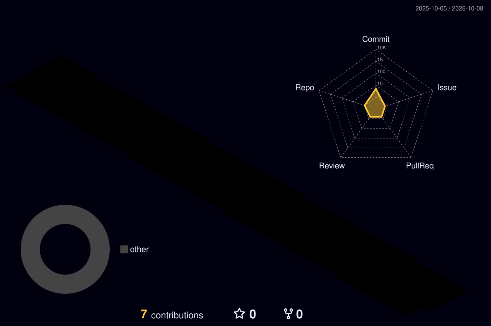

  

  <strong>배우고, 만들고, 기록합니다.</strong> 
  작은 시도를 모아 나만의 별자리를 만들어 갑니다.

 

<h3 align="center">Tech Stack</h3>

  
  &nbsp;
  
  &nbsp;
  

 

### About me

안녕하세요, **hyunbest**입니다. 
Python · Linux · SQL을 중심으로 배운 것과 만든 것을 기록합니다.

| Code | System | Data |
| :--- | :--- | :--- |
| Python으로 문제 풀기 | Linux 환경 이해하기 | SQL로 데이터 다루기 |

 

### A sky full of contributions

작은 기록이 쌓여 하나의 풍경이 됩니다.

<!-- CONTRIBUTIONS:START -->

<!-- CONTRIBUTIONS:END -->

 

  <a href="https://github.com/hyunbest?tab=repositories">Repositories</a>
  &nbsp; · &nbsp;
  <a href="https://github.com/hyunbest?tab=overview">Activity</a>

---

One commit, one little star. HYUNBEST · Learn. Build. Repeat.

